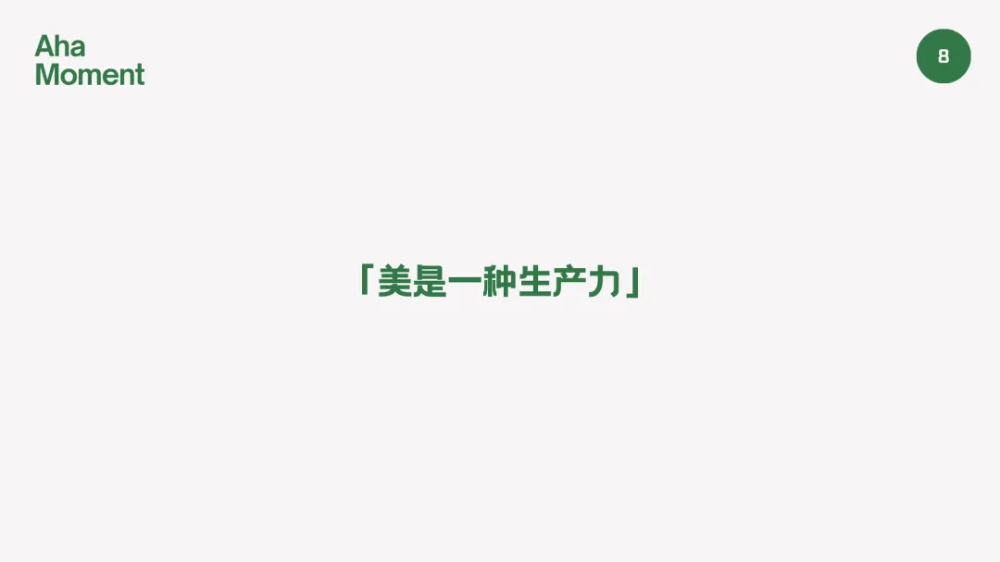
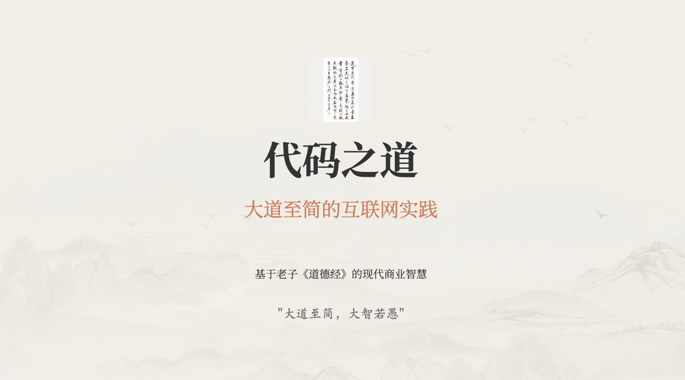
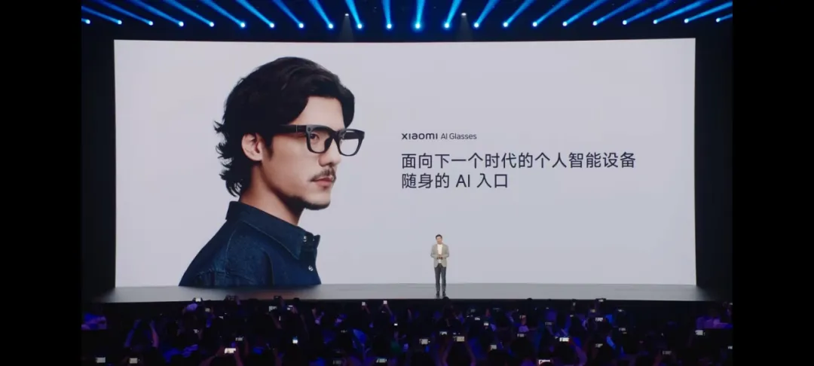

# 关于 Vibe Diary 氛围日记

## 前言

折腾了几个月的编程日记后，回过头来想想，Vibe Diary 氛围日记到底想要解决什么问题，又能给我们带来什么价值。说白了，就是想把那些转瞬即逝的想法、灵感、日常琐事，用更直观的方式记录下来，不再让它们白白溜走。

好了，今天就来聊聊 Vibe Diary 的几个核心思路，也算是对这段时间实践的一个总结。

## 01 日记可视化，让记录留下点什么

传统的日记就是文字记录，写完了放在那里，时间久了自己都懒得翻。Vibe Diary 氛围日记的第一个想法很简单：**让日记可视化，并且真的留下点什么**。

不是说要做得多么炫酷，而是希望通过一些简单的可视化手段，让每天的记录变得更有意思，更容易回顾。比如用颜色、标签、时间轴这些元素，把零散的想法串联起来，形成一个可以"看得见"的思维轨迹。

这样做的好处很直接：当你想回顾某个时期的状态时，不用翻遍所有文字，一眼就能看出那段时间的主要关注点和情绪变化。记录不再是负担，而是真正有用的个人资产。

另外就是捕捉美感，美也是一种生产力。当我们用心记录生活中的美好瞬间时，实际上是在培养自己的审美能力和创造力。这种对美的敏感度会潜移默化地影响我们的思维方式和创作能力。

无论是一张精心拍摄的照片、一段优美的文字描述，还是一个巧妙的想法记录，都是在用自己的创意和审美去创造价值。这种美感的积累不仅能让我们的日记更加生动有趣，更重要的是，它会成为我们创作和思考的重要素材，最终转化为真正的生产力。

## 02 AI 快速拓展，从想法到思路

有了记录，下一步就是如何让这些记录发挥更大价值。这里 AI 的作用就体现出来了：**用 AI 帮你快速拓展想法和思路**。

很多时候我有个模糊的想法，但不知道怎么展开，或者觉得想法太简单不值得深入。AI 可以帮你从不同角度去分析这个想法，提供一些你可能没想到的思路方向。

比如你记录了"今天看到一个有趣的产品设计"，AI 可以帮你分析这个设计的创新点、可能的应用场景、类似的产品思路等等。原本只是一句话的记录，瞬间就能扩展成一个完整的思考框架。

这不是要 AI 替你思考，而是让 AI 成为你思维的放大器，帮你看到更多可能性。

比如我在阅读《THE WAY OF CODE》时产生了一个想法：能否用老子的《道德经》来启发互联网团队的工作方式？于是我让 Manus 帮我探索这个思路，结果不仅为程序员提供了编程哲学的思考，还为运营、产品等不同岗位带来了管理和创新的启发。

## 03 解决家常问题，发现身边的机会

最有价值的产品往往来自最平常的需求。Vibe Diary 鼓励大家**解决家常问题，发现身边的问题**。

就像 Andrej Karpathy 分享的那个拍照菜单生成带图像的 APP 产品，完全是源自生活中的真实痛点：每次点菜都要翻半天菜单，看不懂的还要问服务员。一个简单的拍照识别功能，就能让点菜变得轻松很多。

这种"源自生活，解决自己的问题"的思路，其实是最靠谱的产品方向。因为你自己就是用户，你最清楚痛点在哪里，解决方案是否真的有用。

Vibe Diary 希望成为这种观察和记录的工具，帮你捕捉那些平时容易忽略的小问题、小需求。也许某个看似微不足道的记录，就能成为下一个有用产品的起点。

## 04 结合 AI 硬件，记录无处不在

技术发展到今天，记录的方式也在发生变化。**结合 AI 硬件比如 AI 眼镜，来快速记录当天发生的事情，发挥 AI 记忆的能力**。

想象一下，戴着 AI 眼镜走过一天，它能帮你记录下看到的有趣事物、听到的有价值对话、遇到的问题和灵感。回到家后，这些记录自动整理成结构化的日记内容，你只需要补充一些个人感受和思考。

AI 的记忆能力远超人类，它能帮你捕捉那些转眼就忘的细节，让记录变得更加完整和准确。

当然，技术只是工具，关键还是要有记录和思考的习惯。但有了这些工具的辅助，记录的门槛会大大降低，效果也会更好。

## 总结

Vibe Diary 氛围日记的核心逻辑，可以总结为这样一条链路：

**可视化记录 > AI 拓展思路 > 发现身边机会 > 硬件辅助记录**

按实施的难易程度，可视化记录是最容易开始的，门槛低，效果直观。AI 拓展和硬件辅助需要一些技术和生活积累，但价值空间很大。发现身边机会则需要长期的观察和思考习惯。

最重要的是，这一切都要回归到"记录"这个本质上。不管用什么工具，采用什么方法，核心都是要把那些有价值的想法、观察、灵感真正记录下来，并且让它们发挥应有的价值。
